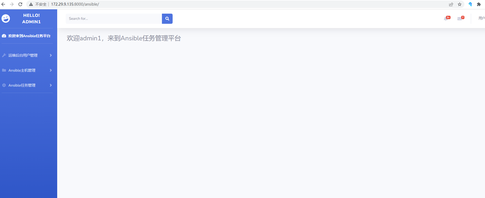
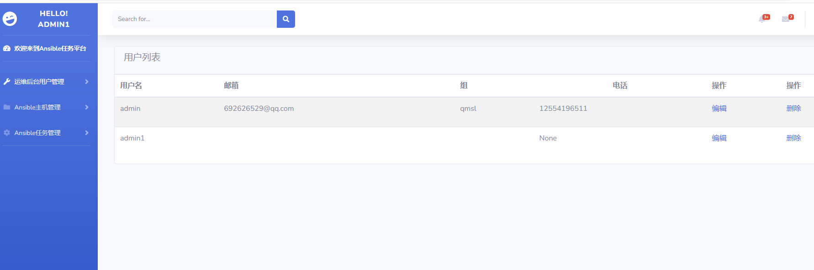
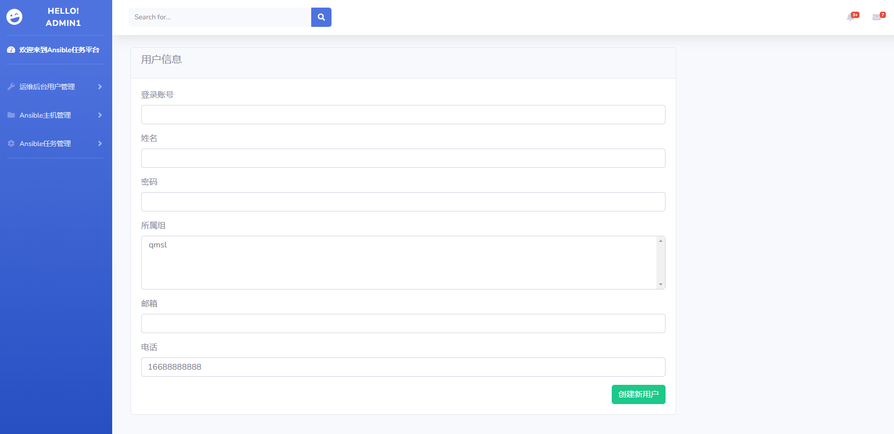
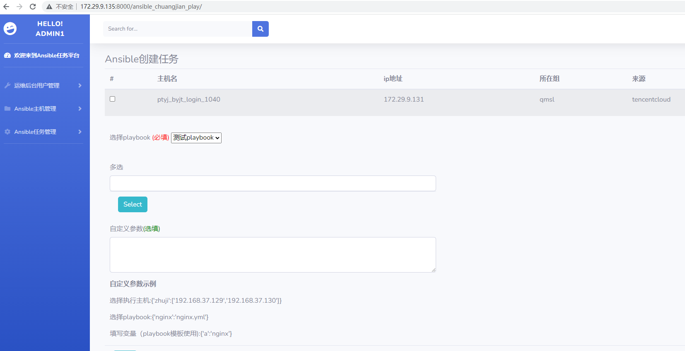
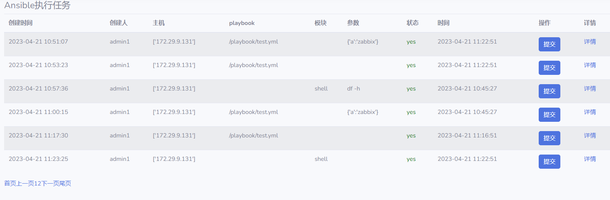
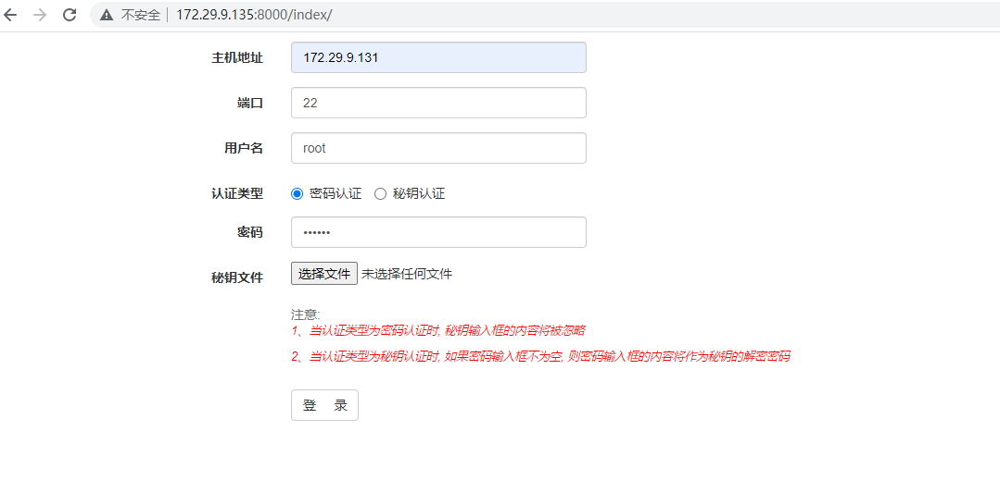
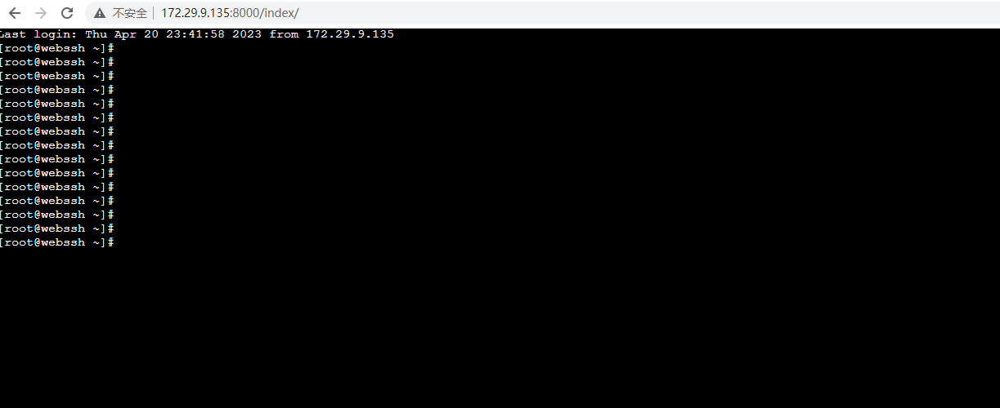

基于django+ansible+ansibleapi+webssh实现的运维自动化管理系统（可当毕业设计）


软件架构说明

- Ansible使用公私钥登录进行主机操作

[](https://github.com/lotus-dgas/AnsibleUI/blob/master/tmp/images/a.png)

## 主要功能：

- 分为管理员，用户两个角色，管理可以增删改查用户
- 管理可以增删改查主机
- 管理员可以为用户分配不同的组
- 用户可以操作对应组的主机
- 实现远程web_ssh连接服务器
- 实现用户可以执行playbook剧本
- 实现用户可以执行 ad_hoc 命令
- 实现审计功能，可以查看玩家历史操作
- 集成bootstrap前端模板


## 安装

mysql客户端从`pymysql`修改成了`mysqlclient`，具体请参考 [pypi](https://pypi.org/project/mysqlclient/) 查看安装前的准备。

使用pip安装： `pip3 install -Ur requirements.txt`


## 运行

修改`djangoblog/setting.py` 修改数据库配置，如下所示：

```
DATABASES = {
    'default': {
        'ENGINE': 'django.db.backends.mysql',
        'NAME': 'order_test',
        'USER': 'root',
        'PASSWORD': 'password',
        'HOST': 'host',
        'PORT': 3306,
    }
}
```

### 创建数据库

mysql数据库中执行:

```
CREATE DATABASE `order_test` /*!40100 DEFAULT CHARACTER SET utf8mb4 COLLATE utf8mb4_unicode_ci */;
```

然后终端下执行:

```
python manage.py makemigrations
python manage.py migrate
```

### 创建超级用户

终端下执行:

```
python manage.py createsuperuser
```

### 运行

终端下执行:

```
python manage.py runserver 0.0.0.0:8000

记得关闭防火墙
```


首页




用户增删改查，分组






执行任务





web_ssh 远程连接







如果需要项目，请添加我的微信 python_kk 或者 QQ：976870170，包运行部署代码讲解